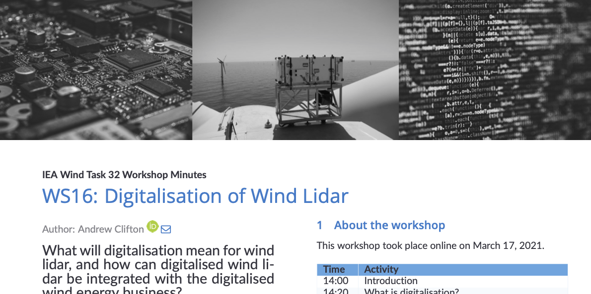

Last release: 29 March 2021 

# IEA Wind Task 32 Workshop 16: Digitalisation of wind lidar
This workshop took place online on 17 March 2021.

**What will digitalisation mean for wind lidar, and how can digitalised wind lidar be integrated with the digitalised wind energy business?**

Wind energy and many other users of wind lidar are going digital, leveraging decades of developments in programming, more reliable communications, and the internet of things. This digital transformation will lead to new ways of working, new opportunities, and new business ideas. But it will also mean that wind lidar will change as well. Together, the wind energy industry and wind lidar will undergo digitalisation.

This workshop used a combination of presentations, group work, and discussions to explore what digitalisation might mean for wind lidar hardware, software, users, and stakeholders.

The minutes of the meeting can be found in [main.pdf](main.pdf).

## Activities
To find out more about Task 32 activities, see the Task 32 website at https://community.ieawind.org/task32/home.

## Citing versions
We suggest using the digital object identifier or 'DOI' to refer to specific versions of the roadmap.

Click on https://doi.org/10.5281/zenodo.4646944 to see the most recent version. On this page you can also find a version history, and then go to the page for the version you want to cite. This approach allows you to find the DOI for a version, e.g.  for the 2021 March 29 version.

## Update history
- 2021 March 29: First written version. 

# How to provide feedback to this document
We welcome constructive feedback on this document. There are two ways to provide feedback to this document.

## ... through Github
You can provide feedback to the roadmap by [raising an issue](https://github.com/IEA-Wind-Task-32/WS16-Digitalisation/issues). Before you raise an issue, please take a few minutes to check if there is a similar one in the list already.

**You will have to be logged in to Github to provide feedback**. This means that your feedback will be associated with your username, which may make it possible to identify you. We prefer to have feedback associated with a name because the roadmap is a community document.

## ... via the IEA Wind Task 32 Operating Agent
Please send your feedback to [ieawind.task32@ifb.uni-stuttgart.de](mailto:ieawind.task32@ifb.uni-stuttgart.de). Please note that your email may be forwarded in its entirety to the rest of the author team. If you need anonymity, please indicate this in your email. Your email should include:
- **Section** What section of the document does this feedback apply to?
- **Feedback:** What is the comment you would like to share?
- **Proposal:** What would you like to see instead?
- **More information:** Where can we get more information? Please provide e.g. a URL.

# About the repository

## Contents
This repository includes:
 - A banner image for use in the repository or elsewhere
 - All of the files required to produce the document using the LaTeX document preparation system.
 - Defined releases, corresponding to the versions listed in the update history, above.

## Maintainer
 - Andy Clifton  
 - See https://doi.org/10.5281/zenodo.4292208 and specific releases for details of the author team.